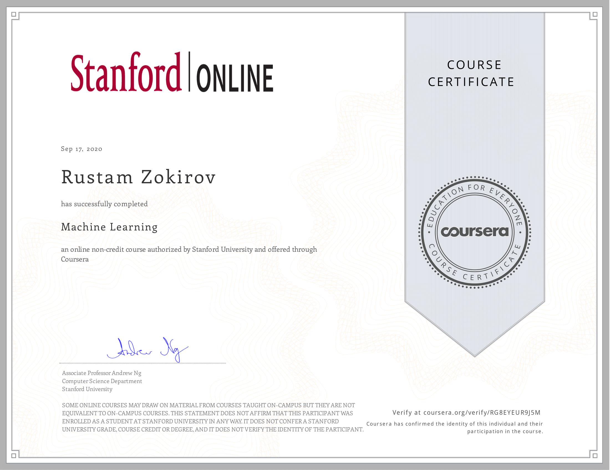

# [Machine Learning by Stanford University](https://www.coursera.org/learn/machine-learning)

My path to learning ML | Rustam_Z 🚀 | DAY-1: 19.08.2020

## Coursera Certificate

Hello, I am writing this message after a long time. I am studying Deep Learning right now. Yes, of course, learning machine learning isn't easy. A great piece of advice I can give you is to focus on one thing, be patient, and learn with enthusiasm. *Focus on just one thing! Work hard, work smart!*

## [Syllabus](https://www.coursera.org/learn/machine-learning/home/info)
- WEEK 1 
    - What is Machine Learning?

    - Supervised/Unsupervised learning

    - Linear Regression with one variable
    
    - Cost Function
        
    - Gradient Descent

    - Gradient Descent For Linear Regression
    
    - Linear Algebra (Matrix & Vector)

- WEEK 2 
    - Linear Regression with Multiple Variables

    - Multiple Features

    - Gradient Descent For Multiple Variables

    - Polynomial Regression

    - Octave Turorial

- WEEK 3 
    - Logistic Regression (Classification problem)

    - Hypothesis Representation 

    - Cost Function

    - Advanced Optimization

    - Multiclass Classification: One-vs-all
    
    - Regularization (The Problem of Overfitting)

        - Cost Function 

        - Regularized Linear Regression

        - Regularized Logistic Regression

- WEEK 4 
    - Neural Networks: Representation

    - Model Representation for Neural Networks

    - Multiclass Classification

- WEEK 5 
    - Neural Networks Learning

    - Cost Function

    - Backpropagation Algorithm

    - Gradient Checking

    - Random Initialization

- WEEK 6 
    - Advice for Applying Machine Learning
        -  Evaluating a Hypothesis

        - Model Selection and Train/Validation/Test Sets

        - Bias vs. Variance

        - Regularization and Bias/Variance

    - Machine Learning System Design
        - Prioritizing What to Work On

        -  Error Analysis

        - Error Metrics for Skewed Classes

        - Data For Machine Learning

- WEEK 7 
    - **Support Vector Machines (SVM)**, is a machine learning algorithm for classification. 

    - Large margin intuition

    - Kernels I & II

    - Using An SVM

- WEEK 8 
    - Unsurepvised Learning: Clustering

    - K-Means Algorithm (groupings of unlabeled data points)

    - Dimensionality Reduction - Principal Component Analysis

- WEEK 9 
    - Anomaly Detection

    - Gaussian distribution

    - Recommender Systems 
        - Collaborative Filtering

        - Low Rank Matrix Factorization

        - Mean Normalization

- WEEK 10 
    - Large Scale Machine Learning

    - Stochastic Gradient Descent

    - Mini-Batch Gradient Descent

    - Online Learning

    - Map Reduce and Data Parallelism

- WEEK 11 
    - Application Examples: Photo OCR

    - Problem Description and Pipeline

    - Getting Lots of Data and Artificial Data

    - What Part of the Pipeline to Work on Next

## Resources
- https://www.coursera.org/learn/machine-learning/resources/zVvo7

- [How to start learning ML](https://www.geeksforgeeks.org/how-to-start-learning-machine-learning/)

- [Top Machine Learning Courses](https://www.learndatasci.com/best-machine-learning-courses) 

- Machine Learning For Absolute Beginners (2018) | Author: Oliver Theobald

- The Elements Of Statistical Learning : Data Mining, Inference and Prediction 

- [Recommended ML books by ProgLib](https://vk.com/wall-54530371_102437)

- https://telegra.ph/What-REALLY-is-Data-Science-09-21
